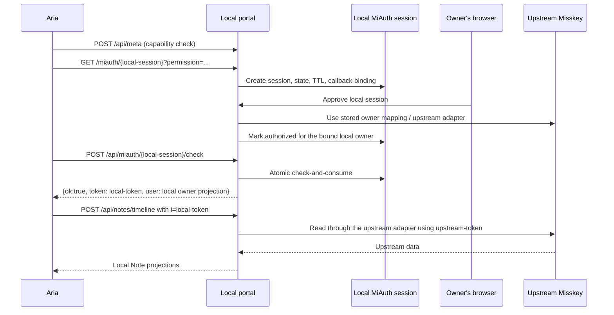

# ADR-0001: Separate local and upstream MiAuth boundaries

- Status: Accepted for Issue #2; implementation is tracked by Issues #5 and #7
- Date: 2026-09-03
- Scope: single-owner MVP

## Context

The service presents a small Misskey-compatible surface to Aria, while the
owner identity and learning data may be backed by an upstream Misskey
instance. Aria's MiAuth session is therefore not the same credential as the
upstream owner's MiAuth session. Treating them as one session would allow a
callback, token, or user ID from one trust boundary to be replayed in the
other boundary.

This ADR fixes the boundaries and the owner-binding rules before endpoint,
database, or authentication implementation begins. The wire details observed
from Aria are recorded separately in
[`docs/compat/aria-v1.5.11.md`](../compat/aria-v1.5.11.md).

## Decisions

### 1. Use configured local and identity origins

The deployment has two distinct canonical origins:

- `LOCAL_ORIGIN` is the configured public origin of this service (HTTPS in
  production). Aria uses it for `/miauth` and `/api/*`; it is also the base for
  any server-side callback endpoint.
- `IDENTITY_ORIGIN` is the fixed upstream Misskey origin used for owner
  verification and provider requests. It is an HTTPS origin in production.

An origin includes scheme, host, and an explicit port when one is configured;
paths are not accepted as either origin. The server uses only
`IDENTITY_ORIGIN` for upstream requests and issuer/instance validation, and
only `LOCAL_ORIGIN` for the local compatibility surface and its callback
destinations. The two values may differ and are never selected by a client.

The server MUST NOT accept an arbitrary upstream host or redirect destination
from a client request. Callback destinations are exact matches against a
deployment allowlist. The compatibility allowlist may contain Aria's
`aria://aria/miauth` callback as an explicitly configured non-HTTPS entry;
all server-side callbacks remain HTTPS in production.

### 2. Bind one owner, with an explicit bootstrap gate

`ALLOWED_MISSKEY_USER_ID` is the preferred and default production control. A
successful upstream verification is accepted only when its opaque user ID
matches this value and its instance matches the configured identity origin.
The pair `(upstream instance origin, upstream user ID)` is stored as the
owner's upstream identity; the ID is never parsed or ordered by the service.

When `ALLOWED_MISSKEY_USER_ID` is unset, the service remains unbound until an
operator presents an explicit bootstrap gate. The gate is:

- generated with `crypto/rand` and shown only through the operator channel;
- single-use, bound to the configured identity origin, and valid for 15
  minutes;
- consumed with an atomic compare-and-set transaction; and
- invalid after a successful binding, expiry, revocation, or a failed binding
  attempt.

There is no public first-login-wins path. A normal Aria MiAuth flow cannot
create or replace the owner binding, and a later upstream account cannot
silently take ownership.

### 3. Keep four credential records distinct

The implementation must use distinct records and types for these values:

| Credential or session | Issuer / consumer | Lifetime and storage rule |
| --- | --- | --- |
| Aria-facing local MiAuth session | Local portal; Aria polls the local check endpoint | Aria supplies an opaque route ID; the server binds it to a separate crypto/rand state, a one-time 10-minute record, callback, `LOCAL_ORIGIN`, requested scopes, and browser/session context |
| Upstream owner-verification MiAuth session | Upstream Misskey; local portal checks it | Opaque, one-time, 10-minute TTL; bind to the configured upstream origin and bootstrap gate when used |
| Local API token | Local portal; Aria sends it as `i` | Return only after successful local check; persist only a one-way hash, support revocation and rotation, never log the raw token |
| Upstream Misskey token | Upstream Misskey; local provider adapter | Never return to Aria; if persistence is required, encrypt at rest with the deployment key, minimize retention, revoke and destroy on unbind or rotation |

If a raw upstream token must survive a short MiAuth polling window, it is
encrypted before persistence, exposed only to the checking transaction, and
deleted immediately after the compatibility-required response. Raw local and
upstream tokens, authorization headers, cookies, and MiAuth state are never
written to logs.

The public `{session}` route value in Aria's MiAuth URL is a correlation key
generated by Aria and is not an authorization capability by itself. The local
server generates and validates its own unguessable state with `crypto/rand`
and atomically binds that state to the route record before authorizing it.

### 4. Scope tokens to the implemented surface

The `permission` query sent by Aria is a requested set, not evidence that the
service implements every requested endpoint. The local token receives only
the effective scopes approved by the service. Implemented endpoints enforce
their exact required scope; unsupported endpoints return a stable explicit
error and never fabricated success.

The Aria request contains permissions outside the MVP (for example drive,
pages, gallery, and chat permissions). Issue #5 must preserve login
compatibility while ensuring those permissions do not create capabilities that
the service does not implement.

### 5. Use explicit state and one-time transitions

Every local or upstream authentication attempt has an unguessable state value
generated with `crypto/rand`, a 10-minute TTL, a bound origin and callback,
and a one-time terminal transition. State comparisons are constant-time. A
check that races another check can have only one winner; all other checks see
an expired or consumed session and cannot mint another token. The public Aria
route session ID is the compatibility correlation key described above, not a
client-selected state value.

The minimum state machines are:

```text
local MiAuth:    created -> authorized -> consumed
                                  \-> expired / denied

upstream MiAuth: created -> authorized -> consumed
                                      \-> expired / denied

bootstrap gate: issued -> consumed
                         \-> expired / revoked
```

The `check` operation atomically attempts the `authorized -> consumed`
transition; it is not a separate durable state. The names describe
server-side state, not a promise about an upstream Misskey's UI. Unknown,
malformed, replayed, mismatched, or late callbacks are terminal failures for
that attempt.

## Identity mapping and wire actors

The local owner identity and upstream identity are deliberately different:

| Concept | Stable value | Meaning |
| --- | --- | --- |
| Local owner | `owner_local_user_id` generated by this service | The only login-capable local actor; returned in local `UserDetailedNotMe` and `Note.user` projections |
| Upstream owner | `(IDENTITY_ORIGIN, upstream_user_id)` | The verified external identity used by adapters; both components are required |
| Assistant actor | Distinct reserved `assistant_local_user_id` with `actor_type=assistant` | A presentation actor for generated replies; never accepted by MiAuth and never a login principal |
| System actor | Distinct reserved `system_local_user_id` with `actor_type=system` | A presentation actor for ingestion/status entries; never accepted by MiAuth and never a login principal |

The three local actor IDs are distinct opaque strings, and the upstream user
ID, note IDs, session IDs, and provider IDs are opaque strings as well. A wire
actor's `host` is `null` for local projections; the upstream host is not copied
into the local account namespace. Actor type is domain metadata and must not
be inferred from a username or note text.

## Authentication sequence

The normal, already-bound flow is:



The unbound bootstrap flow is a separate operator-controlled sequence:

1. An operator opens the short-lived bootstrap gate.
2. The local portal creates an upstream MiAuth session bound to the configured
   `IDENTITY_ORIGIN` and the gate; it does not accept an origin supplied by
   the browser.
3. The operator completes upstream authorization. The local portal checks the
   result, verifies the exact configured user ID when present, and atomically
   stores the owner mapping and encrypted upstream token.
4. The gate is consumed. Only then may a local Aria session be authorized.

The upstream token is used only by the local provider adapter. It is never
placed in a local MiAuth response, local cookie, Aria deep link, or local API
response.

## Threat model

| Threat | Required control | Failure behavior |
| --- | --- | --- |
| Public first-login attacker claims the portal | Required `ALLOWED_MISSKEY_USER_ID`, or explicit bootstrap gate only | Deny binding and do not create a local owner |
| Callback or state replay | Random state, origin/callback binding, constant-time comparison, TTL, atomic one-time consume | Return a generic auth failure; do not mint a token |
| Concurrent bootstrap race | Single-use gate and database compare-and-set under a uniqueness constraint | Exactly one binding succeeds; all other attempts are denied |
| Login or instance mix-up | Fixed `LOCAL_ORIGIN` for the local surface and `IDENTITY_ORIGIN` for upstream; session records carry the applicable canonical origin | Reject mismatched host, scheme, port, or user ID |
| Open redirect / callback exfiltration | Exact callback allowlist; never echo a request URL | Reject the session or use the configured callback only |
| Local token theft from storage or logs | Hash local tokens; structured redacted logging; no authorization headers or cookies in logs | Revoke and rotate the token; do not reveal its value |
| Upstream token theft | Encrypt only when persistence is unavoidable; adapter-only access; revoke and destroy on unbind | Mark upstream integration unavailable without invalidating saved posts |
| Scope escalation through Aria's broad request | Effective-scope intersection and endpoint-level scope checks | Explicit permission error for unsupported capabilities |
| Session fixation or confused session IDs | Aria's route ID is only an opaque correlation key; server-generated random state, session-to-origin/callback binding, and no client-selected state | Reject mismatched session and expire it |
| Sensitive content exposure during diagnostics | Redact bodies, prompts, tokens, mail, cookies, and upstream errors | Keep only request/job IDs and categorized errors |

## Consequences and follow-up

- Issue #5 implements the state machines, bootstrap gate, owner binding, and
  token lifecycle.
- Issue #7 exposes only the minimal local Aria/Misskey surface described in
  the compatibility document.
- The local service can keep accepting user posts when upstream or LLM work
  is unavailable; owner authentication is not coupled to background jobs.
- Multi-user tenancy, general user administration, federation, and arbitrary
  upstream instances remain outside this ADR and the MVP.
